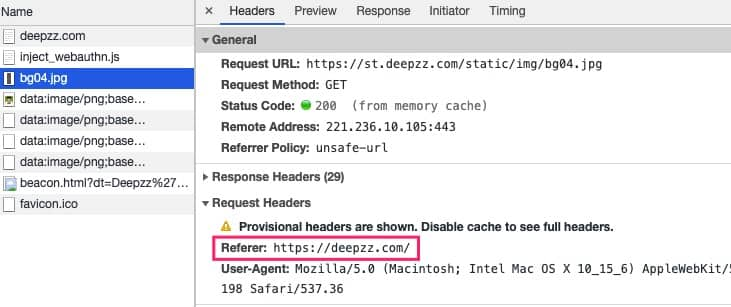

### 防止盗链

为什么要防盗链？这是一个需要思考的问题。

这里所说的防盗链是指资源链接，如图片，视频等文件资源。想一想，如果我们A站点的资源链接被别人利用，挂在B站点上，当B站点用户请求量一多，大量的下载请求打到我们服务器，造成服务器带宽压力过大，让A站点变得很慢，用户体验超级差，这明显是不能忍受的。

#### 原理

原理很简单，通过资源请求中的 `Referer` 来进行判断。熟悉浏览器原理的人都知道，浏览器在去请求某个资源的时候，会携带 HTTP Header `Referer`，表明请求这个资源的来源，如：



这个是浏览器的行为，所以对于盗用链接的人来说并不能够控制。因此，我们只需要判断 `referer` 的来源就OK。

#### 配置

nginx支持防盗链功能，也就是支持验证 `Referer`。

```
server {
    listen       80;
    server_name  example.com;

    # 验证HTTP Header中的Referer是否匹配
    valid_referers none blocked server_names
                   *.example.com example.* www.example.org/galleries/
                   ~\.google\.;

    location / {
        root   /usr/share/nginx/html;
        index  index.html index.htm; # 默认文件
    }
}
```

其中 valid_referers 可选值为：

* none，请求中不包含 Referer
* blocked，请求中包含 Referer，但值被防火墙或者代理服务器删掉
* server_names，请求中 Referer 是 server_name 中的一个
* `*`，统配前后缀匹配，如 `*.example.com` 或 `example.*`
* 正则匹配，由 `~` 开头，将匹配 `http://` 或 `https://` 后的内容