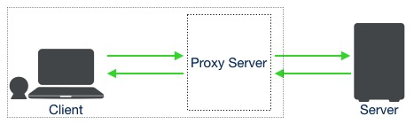
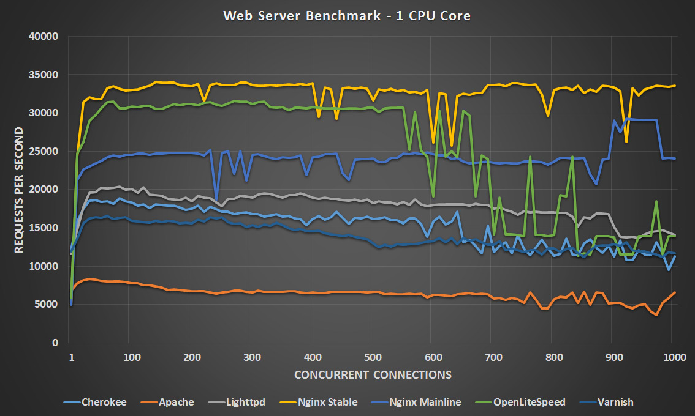

# nginx 介绍

首先想说一说 nginx 是什么？nginx 又有什么用？聊一聊我知识范围内的代理服务器与负载均衡器。

nginx（engine x） 是一款软件，一款可用于 Web 服务、反向代理、缓存、负载均衡、流媒体等的开源软件。从最初的实现高性能稳定的 Web 服务器到现在也可作为电子邮件（IMAP、POP3 和 SMTP）代理服务器以及 HTTP、TCP 和 UDP 服务器的反向代理和负载均衡，nginx 很强大。

目前来说，nginx 已发展得非常的成熟，社区活跃，现已有以下关联版本：

| 版本       | 说明                                                         |
| ---------- | ------------------------------------------------------------ |
| Nginx Plus | nginx 的商用版本，较开源版本提供完善的技术支持，支持配置动态加载（提供Admin管理API） |
| Nginx      | nginx 的开源版本                                             |
| OpenResty  | 基于 nginx 提供 Lua 脚本编写版本                             |
| Kong       | 基于 OpenResty cloud-native 版本                             |

### nginx 功能

nginx 在我们实际的使用过程中能帮助我们做什么？

**正向代理**

什么是代理？代理就是帮助你（client）处理与服务器（server）连接请求的中间应用，我们称之为 proxy server。

那什么又是正向代理呢？简单说，对于 client，想要连上 server，如果这个中间过程你知道代理服务器的存在，那这就是正向代理（即这个过程是 client 主动的过程）。举例来说，我想访问 example.com，此时我通过 vpn 代理服务器进行代理，这个过程就是正向代理。又比如我们需要操作服务器 A，但又必须通过跳板机进行代理，这个过程也是正向代理。

**反向代理**

反向代理与正向代理相对，对于 client，直接访问当目标服务器 server（proxy），但目标服务器 server 可能会将请求转发到其它应用服务器 server（app）（即这个过程是 server 主动的过程）。其对用户是透明的，如用户去访问 example.com，他并不知道该网站背后发生了什么事，一个 API 请求被转发到哪台服务器。

**负载均衡**

负载均衡的需求来自什么？来自于因业务量的快速提升对服务器造成的压力，也因此使得我们不得不改变单一服务器的架构模式以应对海量或突发峰值的流量。负载均衡在其中起到关键性作用：

1. 解决并发压力，提高应用处理性能（增加吞吐量，加强网络处理能力）；

2. 提供故障转移，实现高可用；

3. 通过添加或减少服务器数量，提供网站伸缩性（扩展性）；

4. 安全防护；（负载均衡设备上做一些过滤，黑白名单等处理）

负载均衡很复杂！

如为了应对复杂的网络环境和流量带宽的限制，现代网络已经将如静态文件（图片，下载包）之类的内容通过 CDN 方式分发内容。这其中就使用了 DNS负载均衡的技术（智能DNS），这里不做过多阐述。

目前的很多设备已经支持 OSI 模型中的二层、三层、四层和七层的负载均衡了：

* 二层，基于网络接口的负载均衡
* 三层，基于服务器 IP 地址的负载均衡
* 四层，基于 TCP/UDP 端口的负载均衡
* 七层，应用层负载均衡，如 URL、HTTP 表头等

nginx 可基于四层和七层做负载均衡，七层负载均衡主要靠的是负载均衡算法，常见的有：

* 轮询（rr），将流量按服务器顺序依次分配，如有三台服务器，请求将会按照 "1、2、3、1、2、3..." 这样的顺序到达服务器
* 最少连接数（lc），将流量分配到当前活动连接较少的服务器
* 最快回应（sr），将流量分配到最短响应时间的服务器
* 保持 IP 地址，将流量的源 IP 地址与后台某一服务器长期关联起来
* 保持 cookie，将一种 cookie 的值与后台服务关联起来
* 插入 cookie（ic），即动态插入 cookie 来保持客户端与服务器的长期对应关系
* 重写 cookie（rc），即实时改写服务器的 cookie 来保持与客户端的长期对应关系
* 就近性（prox），基于 SDNS 的就近性信息，将流量分配到离客户端最近的服务器
* SNMP（snmp），根据服务器的 SNMP 的 MIB 信息来判断服务的健康状态和可用性
* 嵌套 cookie（ec），嵌套 cookie 在服务器端返回的 cookie 中插入信息，以保持后台服务器和 客户端之间的连接
* 哈希 query（hq），此算法通过计算 HTTP 请求的 query 中指定的标签的哈希值保持会话的持 续性。同时这个方法必须与 persistent url 策略一起使用
* Qos URL，Qos URL（区分服务质量的 URL 算法）利用客户请求中 URL 的一部分来 做出负载均衡决策。如对 `/german/` 的算法，只要包含它就被分配到德语服务器
* Qos Hostname（qh），基于客户端请求中的 `Host` 头做负载均衡

### nginx 优势

nginx 作为一款高性能高稳定性的服务器软件，从创立之初就彻底改变了服务器在高性能环境中的运行方式，也成为了最快的 web 服务器。一篇 2016 年的性能测试：[Linux Web Server Performance Benchmark – 2016 Results](https://www.rootusers.com/linux-web-server-performance-benchmark-2016-results/)：

可见，nginx 有非常高的处理性能，1核心可以达到 30k 的 RPS。

在我看来，nginx 不仅有高性能，还有如下优点：

* 轻量级，消耗资源少，这也是性能高的原因之一
* 高度模块化的设计，架构清晰简单
* 事件驱动架构
* 请求的多阶段异步处理
* 管理进程、多工作进程设计
* 内存池的设计
* 社区活跃，有活跃的社区对开源软件来说尤为重要
* 功能完善，静态文件服务器，反向代理，负载均衡以及 GPRC 代理，邮件代理等

nginx 现在也已经被 F5 收购，依托 F5 的解决方案，F5 和 NGINX 将在所有环境中实现多云应用服务，提供开发人员所需的易用性和灵活性，同时还提供网络运营团队所需的规模、安全性和可靠性等能力。

